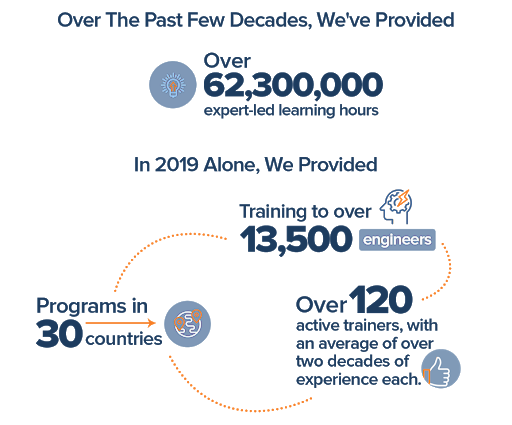
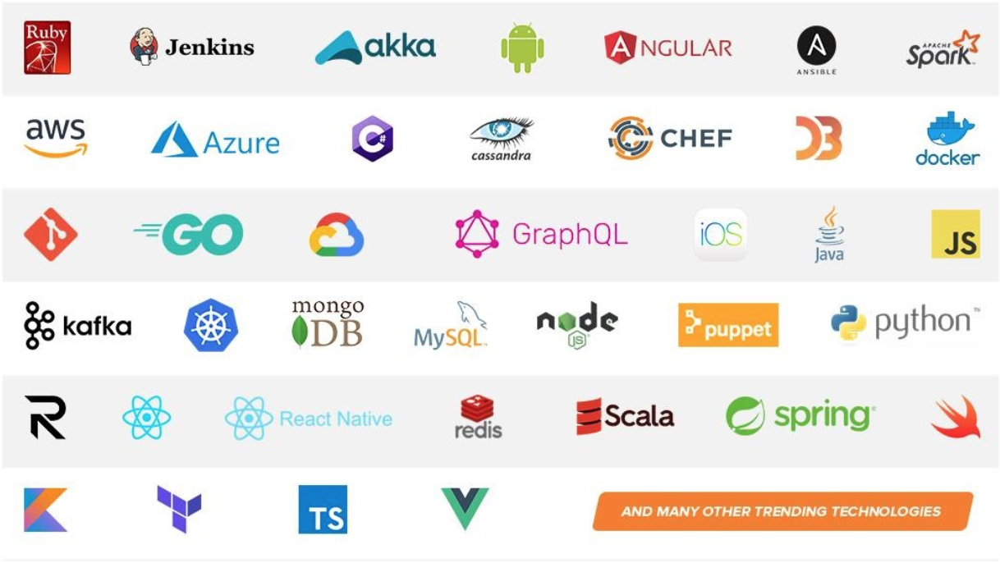
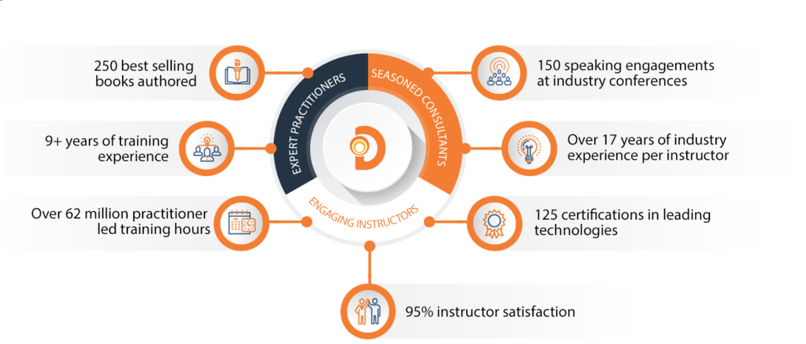
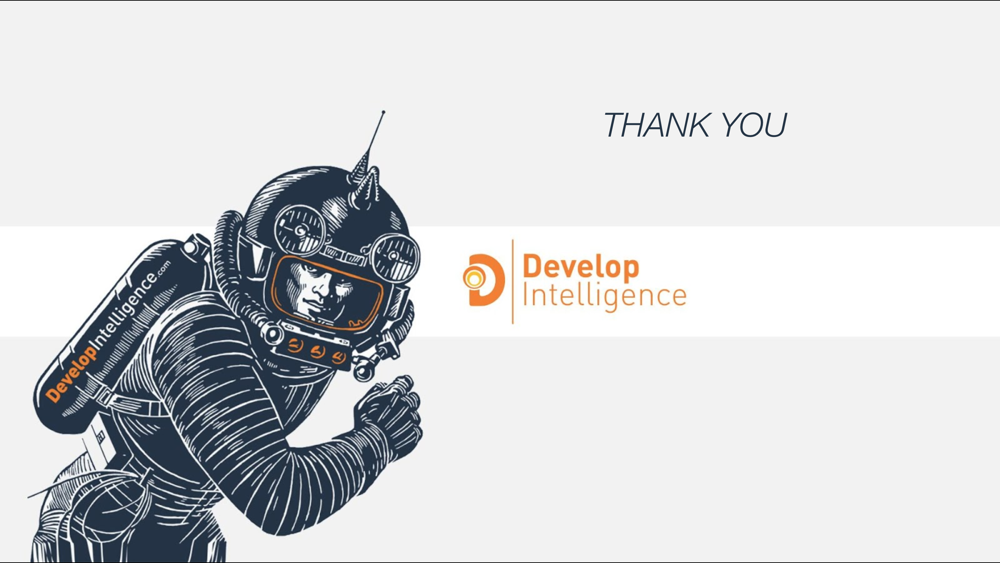

# Welcome to Introduction to Node.js!

## Introductions

Welcome to your first day of DevelopIntelligence's Introduction to Node.js course! Let's go around the room and say your:

- Name
- Pronouns
- Current role
- Location
- Learning goals for the course

## Join Us in Making Learning Technology Easier

### Our Mission

Over 16 years ago, we embarked on a journey to improve the world by making learning technology easy and accessible to everyone.

### …impacts everyone daily.

And it’s working. Today, we’re known for delivering customized tech learning programs that drive innovation and transform organizations.

In fact, when you talk on the phone, watch a movie, connect with friends on social media, drive a car, fly on a plane, shop online, and order a latte with your mobile app, you are experiencing the impact of our solutions.

## Technologies We Cover

Here are some of the technologies we cover...

## World-Class Practitioners

Here is some data showing instructors are expert practitioners, engaging instructors, seasoned consultants. We are the best in the business!

## Note About Virtual Trainings

### What We Want...

### What We've Got...

It is good to call the elephant out in the room. Everyone would prefer to be on-site together. That is not going to happen for this class, so let’s dig in, be interactive and have fun!

In a classroom, it’s easy to see your faces and know if topics are understood–be sure to let me know if anything is unclear!

## Virtual Training Expectations for You

- Arrive on time / return on time. Just because this is a virtual class doesn’t mean it’s ok to inconvenience peers who showed up on time.
- Mute yourself unless asking a question/commenting
- Ask questions (verbally or via the Slack chat)
- There are no stupid questions...if your solution yields the right answer then it's correct even if you did it differently than others!

## Virtual Training Expectations for Me

I pledge to:

- Make this as interesting and interactive as possible. I will do the best to mix it up with Zoom/Slack tools, hands-on activities, breaks, group work, and breakout rooms
- Ask questions in order to stimulate discussion
- Use whatever resources I have at hand to explain the material
- Try my best to manage verbal responses so that everyone who wants to speak can do so
- Have regular 10-minute breaks

## Prerequisites

- This course assumes students have prior web development and JavaScript knowledge. This class may not be the best fit if the student is coming to learn the basics of programming.
- That said, we will review a few JavaScript essentials for using and applying Node.js in this course.

## Learning Objectives

At the completion of this course you will be able to:

- Use Node.js to build server-side JavaScript applications
- Deepen your JavaScript knowledge to build better applications
- Build web applications with Express & Socket.io
- Use Node Package Manager (npm) to manage, build & publish packages

Here are the two main projects we will be building:

- [Express Recipes API](https://evening-badlands-19313.herokuapp.com/api/v1/recipes)
- [Trivia Game](https://shielded-headland-08484.herokuapp.com/)

We will learn Node.js concepts while building out these two projects.

## [Course Agenda](./README.md)

## Why Node.js?

- **Node.js is gaining popularity in the industry.** As of July 2020, Node.js had [~70k stars on Github.](https://github.com/nodejs/node) [Lots of big companies](https://youteam.io/blog/top-companies-that-used-node-js-in-production/) (e.g., Netflix, Uber, [Paypal](https://medium.com/paypal-engineering/node-js-at-paypal-4e2d1d08ce4f), Microsoft) are using it! It is a popular choice in [microservice-oriented architectures](https://thenewstack.io/enterprises-embracing-microservices-node-js/).

- **Node.js is light, scalable, & fast.** Node.js uses a single-threaded, non-blocking I/O model capable of processing multiple concurrent requests using asychronous request handling. Node.js is an excellent choice for building highly scalable and performant applications. We will learn what makes Node.js awesome in this course.

- **Node.js is supported by a large, active open-source community.** [Node Package Manager](https://www.npmjs.com/)(NPM) is the largest software registry in the world, hosting more than one million free, open-source packages. 11 million developers worldwide rely on NPM's publicly available and reusable modules. Every Node.js installation also comes with a package management tool, `npm`, which allows modules to be easily installed and offers version and dependency management of packages. Some of the most useful `npm` modules today are [Express.js](http://expressjs.com/) and [Socket.io](https://socket.io/), which we will explore in this course.

## Structure of the Course/Takeaways

- I will be teaching primarily from a Github repo; all course materials are hosted on Github at [this link](https://github.com/intro-to-nodejs/intro-to-nodejs-course).
- This course will utilize a mix of lecture, discussion, live-demo's/code-along's, labs, and breakout group activities.

  - **_TRY-IT-OUT_**: execute cli commands and small code snippets
  - **_CODE-ALONG_**: essential setup steps for course projects
  - **_CHALLENGE_**: code a solution from scratch, with the help of documentation
  - **_DISCUSS_**: talk about key concepts with your breakout group
  - **_REVIEW_**: check your understanding by reviewing key concepts from a particular unit

## Course Expectations

- What are your expectations for this course? What are you hoping to get out of this course?

## Course Evaluations

- Official evaluations will happen on the last day of the course, but feel free to give me any feedback before then
  - How is the pace?
  - Was there anything confusing that was not resolved?
  - Are there topics we should review?
- If you prefer, you can use the [anonymous feedback form](https://forms.gle/E6GpH5QUEJLjMqVF6) to provide feedback anytime.

## Thank You

