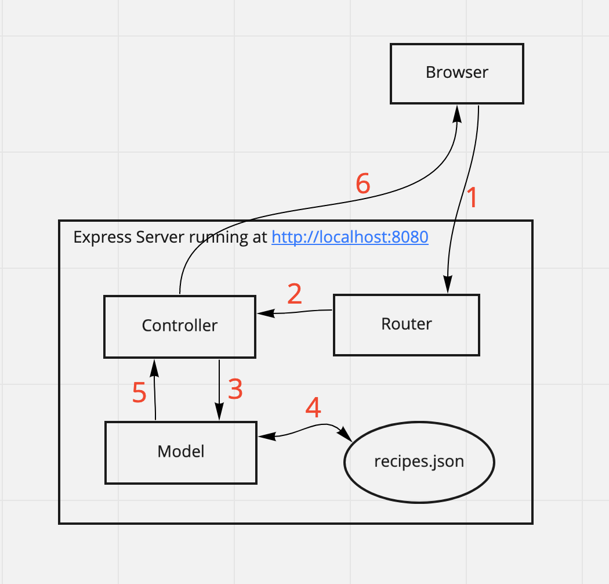
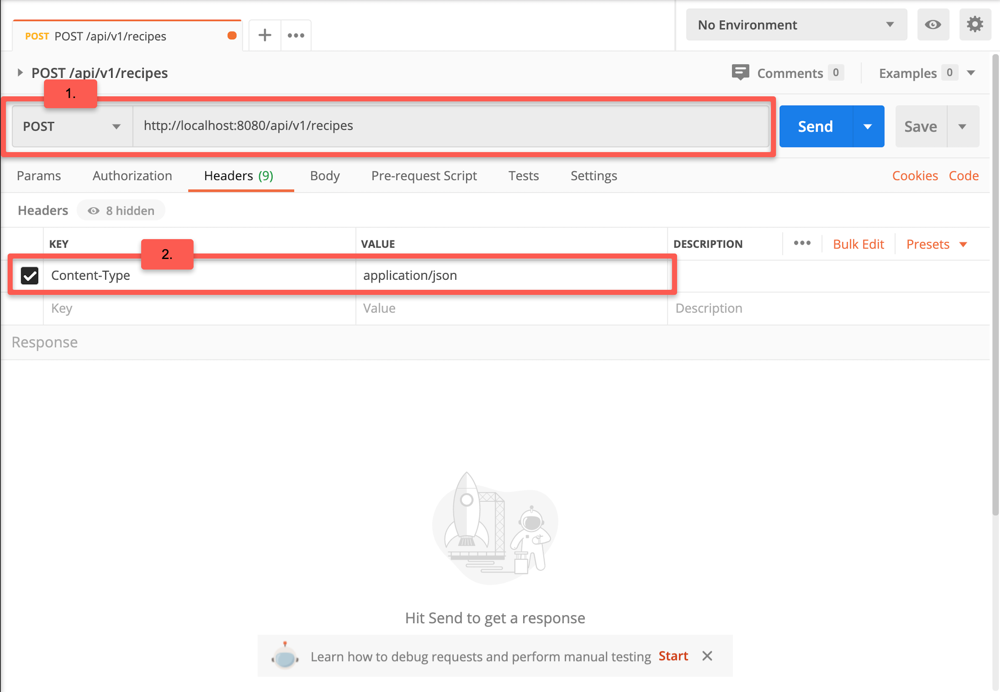
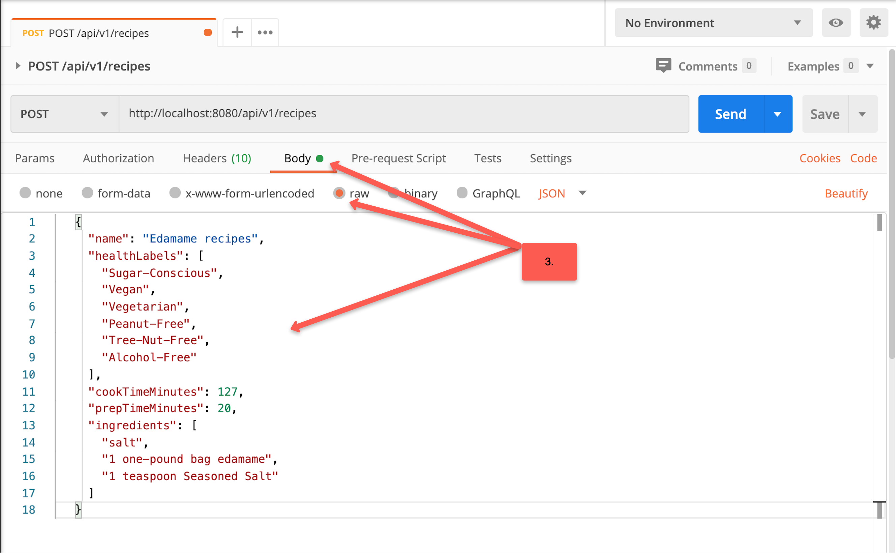
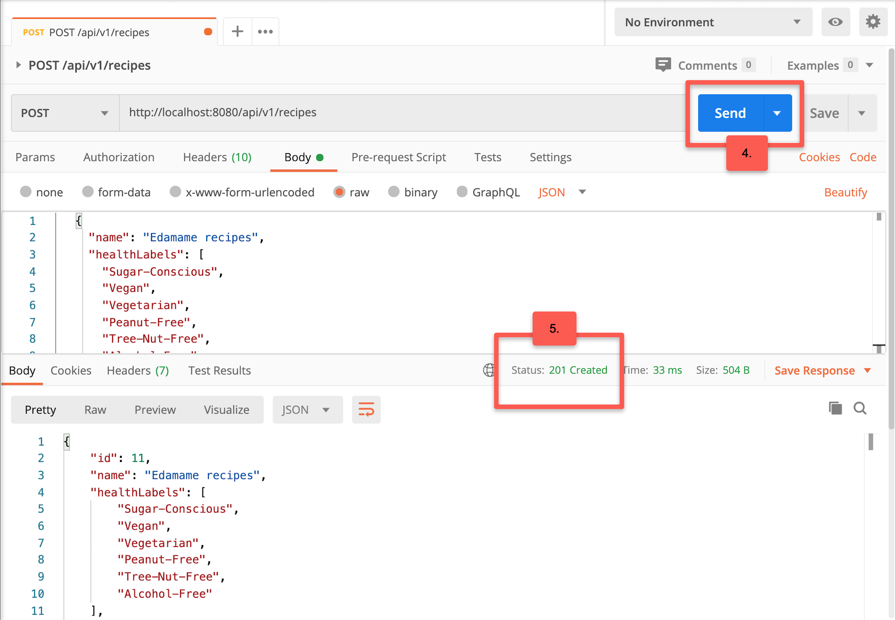
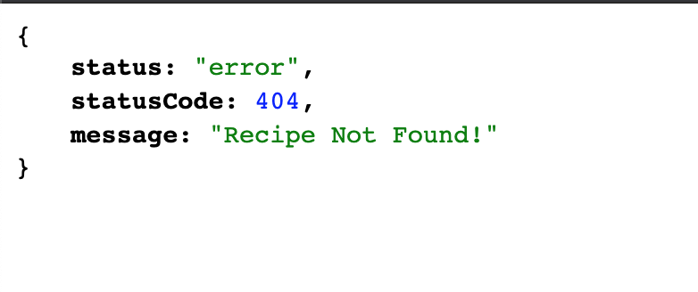

# Introduction to Express

## Learning Objectives

By the end of this lesson, you will be able to:

- Install and use Express to handle HTTP requests
- Build a RESTful API with Express
- Utilize the Node Package Manager (npm) to install and manage Node.js package dependencies

## Table of Contents

- [Express Overview](#express-overview)
- [Express Recipes Request-Response Cycle](#express-recipes-request-response-cycle)
- [The Node Package Manager & Node Community](#the-node-package-manager--node-community)
- [Creating Your First Express Project](#creating-your-first-express-project)
  - [Step 1: Setup Your Project Folder](#step-1-setup-your-project-folder)
  - [Step 2: Create a package.json File](#step-2-create-a-packagejson-file)
  - [Step 3: Install Project Dependencies](#step-3-install-project-dependencies)
  - [Step 4: Add a .gitignore File](#step-4-add-a-gitignore-file)
  - [Step 5: Create a Basic Express Server](#step-5-create-a-basic-express-server)
- [Implementing Routing](#implementing-routing)
  - [Step 6: Express Route Handler](#step-6-express-route-handler)
  - [Step 7: Dynamic Routes](#step-7-dynamic-routes)
  - [ASIDE: Installing Nodemon](#aside-installing-nodemon)
  - [Step 8: Serving Static Assets](#step-8-serving-static-assets)
- [Implementing Middleware](#implementing-middleware)
  - [Step 9: Implement Application-Level Middleware](#step-9-implement-application-level-middleware)
- [Building a RESTful API with Express - `res.json()`](#building-a-restful-api-with-express---resjson)
  - [RESTful API Overview](#restful-api-overview)
  - [JavaScript Object Notation (JSON) Overview](#javascript-object-notation-json-overview)
  - [Step 10: Move & Clean Up `index.js`](#step-10-move--clean-up-indexjs)
  - [Step 11: Use the `express.Router` class to Create Modular Route Handlers](#step-11-use-the-expressrouter-class-to-create-modular-route-handlers)
  - [Step 12: Implement Route Handler for `GET /api/v1/recipes`](#step-12-implement-route-handler-for-get-apiv1recipes)
  - [Step 13: Implement Route Handler for `POST /api/v1/recipes`](#step-13-implement-route-handler-for-post-apiv1recipes)
  - [Step 14 (**_CHALLENGE_**): Implement Route Handler for `GET /api/v1/recipes/:id`](#step-14-challenge-implement-route-handler-for-get-apiv1recipesid)
  - [Step 15 (**_CHALLENGE_**): - Implement Route Handler for `PUT /api/v1/recipes/:id`](#step-15-challenge---implement-route-handler-for-put-apiv1recipesid)
  - [Step 16 (**_CHALLENGE_**): Implement Route Handler for `DELETE /api/v1/recipes/:id`](#step-16-challenge-implement-route-handler-for-delete-apiv1recipesid)
  - [Step 17: Redirect the Base Url `/` to `/api/v1/recipes`](#step-17-redirect-the-base-url--to-apiv1recipes)
  - [Step 18: Enable CORS](#step-18-enable-cors)
  - [Step 19: Refactor Your Route Handlers into Separate Controller Layer](#step-19-refactor-your-route-handlers-into-separate-controller-layer)
  - [Step 20: Refactor Your Database-Related Logic into Separate Model Layer](#step-20-refactor-your-database-related-logic-into-separate-model-layer)
  - [Step 21: Handle Errors Centrally](#step-21-handle-errors-centrally)
- [**_REVIEW_**](#review)
- [Other Node.js Frameworks & Tools](#other-nodejs-frameworks--tools)
- [Additional Resources](#additional-resources)

## Express Overview

Node.js is commonly used as a web server to serve up websites, JSON, and more. However, its syntax could be verbose. [Express](http://expressjs.com/) is a popular server-side framework for building web applications on Node.js.

Express is minimalistic and provides a lightweight abstraction over the Node.js HTTP modules and convenience methods for creating routing, views, and middleware.

## Express Recipes Request-Response Cycle

In this section, we will be building a RESTful API that allows consumers to retrieve, create, update, and delete recipes, step-by-step.

Along the way, we'll learn about `npm` and how to use `npm` to manage Node.js packages. We'll learn how to configure Express to return html templates as well as JSON data to the user.

Take a look at the [deployed Express Recipes API](https://evening-badlands-19313.herokuapp.com/).

**You can find the code for the [completed project here](https://github.com/intro-to-nodejs/express-recipes).**

## The Node Package Manager & Node Community

Before we start building our application, let's take a moment to understand what the [Node Package Manager](https://www.npmjs.com/)(or `npm` for short) is. `npm` consists of three distinct components:

- **_`npm` is the world's largest (JavaScript) software registry._** Open source developers from across the globe use `npm` to share and borrow packages, and many organizations use `npm` to manage private development as well.

  The large public database of packages means there's a package for almost everything! You can download and adapt these packages for your applications or incorporate them as they are.

  However, since anybody can publish a package to the `npm` registry, `npm` packages might not all be of the same quality. Often, there are dozens or even hundreds of packages with similar names and/or purposes.

  **_DISCUSS_**:

   <details>
      <summary>
      What criteria would you apply to select packages for your project?
      </summary>

  We can turn to the npm website for help here. When you use the search bar on the [`npm` website](https://www.npmjs.com) to find packages, it returns a list of packages and allows the users to rank them by four criteria:

  - **_Popularity_**: How popular is the package? If a package has thousands or even millions of downloads, that's probably a strong indicator that others have found the package to be useful. Check out https://www.npmtrends.com/ where you can compare the popularity of different comparable packages.

  - **_Quality_**: What steps have the package creator/maintainer taken to ensure high quality? The presence of a README file, package stability, tests, and up-to-date dependencies are characteristics of a high quality package.

  - **_Maintenance_**: How well-maintained is the package? Meaning is the package frequently updated to work well with other dependencies or new versions of the `npm` CLI?

  - **_Optimality_**: How optimal is the package? Optimal combines the three criteria mentioned above (ie., popularity, quality, maintenance) into one meaningful score.

  The `npm` search bar is powered by npms and the npms analyzer. See https://npms.io/about for more information on both.

   </details>

- **_`npm` also provides a user interface for managing your public and private packages_** and other aspects of your `npm` experience. Here, you can accomplish tasks such as creating organizations to coordinate package maintenance and restricting code to specific developers.

- **_`npm` also refers to the command-line interface (CLI) tool for downloading and managing Node.js packages._** `npm` came bundled with your Node.js installation and is how most developers interact with the `npm` registry. While `npm` is the standard package manager for Node.js, there are other alternatives such as [`yarn`](https://yarnpkg.com/) (we will only be using `npm` in this course).

## Creating Your First Express Project

Get ready to create your first Express project! We will learn about the `npm` CLI along the way.

### Step 1: Setup Your Project Folder

1. Navigate to your `intro-to-nodejs-course` folder.

1. Create a new directory called `express-recipes` and change into it:

   ```
   $ mkdir express-recipes
   $ cd express-recipes
   ```

### Step 2: Create a `package.json` File

1.  Turn your directory into an npm package by running:

    ```
    $ npm init
    ```

    **_DISCUSS_**: What happens when you run the command above?

    It loads a questionnaire that asks you questions about how you would like to configure your package (e.g., project name, licenses, and version)!

    Let’s just press `Enter` on every question to accept the defaults.

    A manifest file called `package.json` is then created, which lists the names and versions for all packages your project depends on, amongst other things:

    `package.json`:

    ```json
    {
      "name": "express-recipes",
      "version": "1.0.0"
    }
    ```

    **_DISCUSS_**: What else do you think `package.json` does?

    - It specifies versions of a package that your project can use, based on [semantic versioning rules](https://docs.npmjs.com/about-semantic-versioning).

    - It also serves to centralize configuration for tools (e.g., testing).

    A `package.json` file **_must_** include the following fields:

    - The `name` field which contains your package’s name, which must be lowercase and may contain hyphens and underscores (e.g., `my-express-package`). Try to choose a name that is unique, descriptive and meets [npm policy guidelines](https://www.npmjs.com/policies). Make sure it is not spelled in a similar way to another package name and will not confuse others about authorship.

    - The `version` field must be in the `x.x.x` format and follow semantic versioning guidelines.
      <details>
         <summary>
         ASIDE: What is semantic versioning?
         </summary>

      Let's take a moment to talk about `npm` semantic versioning.

      Well, every time you make significant updates to an `npm` package, it is a best practice to publish a new version of the package with an updated version number in the `package.json` file for a few reasons:

      - Having a consistent system for upticking project dependencies helps other developers understand the scope of changes in a given version and update their codebases as needed.
      - Specifying an explicit version of a library also helps to keep everyone on the same exact version of a package, so that the whole team runs the same version until the `package.json` file is updated.

      In the `npm` ecosystem, developers follow `npm`'s [semantic versioning guidelines](https://docs.npmjs.com/about-semantic-versioning) when updating their packages' version numbers.

      Semver (semantic versioning relies on the `x.x.x` 3-digit format, the first digit being the major release, the second the minor release and the third is the patch release.

      Updated packages might contain only backward-compatible bug fixes (i.e., a patch release) or backward-compatible new features (i.e., minor release), in which case the package could be incorporated presumably without much hassle.

      Changes that break backward compatibility, on the other hand, would typically require a higher level of engineering planning and time to incorporate into the project.

      Thanks to semver, you can easily specify any version of a package, or require a version higher or lower than what you need by using special symbols (e.g., `~`, `^`) in your `package.json`'s dependency list.

      [`npm`'s semver calculator](https://semver.npmjs.com/) is a useful tool for defining appropriate acceptable package ranges for our project dependencies.

      What do the `^`(aka carat or hat symbol) and `~`(aka tilde symbol) notations mean when defining package versions here?

      `package.json`:

      ```json
      "dependencies": {
         "awesome_dep": "^0.13.0",
         "another_awesome_dep": "~5.2.0"
      },
      ```

      In your `package.json`, if you write:

      - `~0.13.0`, patch releases will be updated when running `npm install`, meaning `0.13.1` is acceptable, but `0.14.0` is not.
      - `^0.13.0`, patch and minor releases will be updated when running `npm install`, so `0.13.1`, `0.14.0` and so on are acceptable.
      - `0.13.0`, that exact version will always be used. In other words, the dependency is locked.

      </details>

Other [optional fields](https://nodejs.dev/learn/the-package-json-guide) include, but are not limited to:

- `author`
- `contributors`
- `description`
- `main`
- `private`
- `scripts`
- `dependencies`
- `devDependencies`
- `engines`
- `browserslist`

Congratulations, you just created your first `npm` package! When you hear the term `package`, it just refers to a file or directory that is described by a `package.json` file. To be published to the `npm` registry, a package must contain a `package.json` file.

NOTE: If you ran `npm init --yes` instead, `npm` will create a default `package.json` using information extracted from the current directory. This option is seldom used, since developers often want to customize the manifest instead of using default values.

**_DISCUSS_**:

<details>
  <summary>What do you think is the purpose of the package-lock.json file?</summary>

The goal of the file is to keep track of the exact version of every package that is installed so that a product is 100% reproducible in the same way even if packages are updated by their maintainers.

This solves a very specific problem that `package.json` left unsolved.

In `package.json`, you can set which acceptable versions to upgrade each of your packages to (patch or minor), using the semver notation (e.g., ^ or ~).

What that means is, if another person tries to replicate the project on their machine by using the `npm install` command, they might end up with different versions of the dependencies. So your original project and the newly initialized project on someone else's machine could actually be different.

Even if a patch or minor release should not introduce breaking changes, bugs can occasionally creep in, and the maintainer might also mistakenly label a breaking change as non-breaking.

What `package-lock.json` does is **_set your currently installed version of each package in stone_**, and `npm` will use those exact versions regardless of who is running `npm install`, thereby ensuring package consistency across the team.

</details>

### Step 3: Install Project Dependencies

1.  Install `express` in your project:

    ```
    $ npm install express
    ```

    **_DISCUSS_**:

    <details>
     <summary>
     What does running the above command create in your folder?
     </summary>
      A new folder called `node_modules` is created. 
      
      It is the folder where `npm` installs the packages the project needs (i.e., dependencies). 
      
      `express` package is installed in the current file tree, under the `node_modules` subfolder.
      
      As this happens, `npm` also adds the `express` entry in the dependencies property of the `package.json` file present in the current folder.

    </details>

1.  To see the latest version of all the `npm` packages installed, including their dependencies, you can run:

    ```
    $ npm list
    ```

### Step 4: Add a `.gitignore` File

1. In general, we should avoid committing generated code (e.g., `node_modules`) to the Git repository. So let's add a `.gitignore` file to the root directory:

   ```
   $ touch .gitignore
   ```

   Add `node_modules` to the first line of the `.gitignore` file.

   **_DISCUSS_**:
   <details>
      <summary>
      Since the project dependencies are not committed to the Git repository, how would other developers get these dependencies when they clone the project to their local machine?
      </summary>

   Well, `package.json` makes your build reproducible, and therefore easier to share with other developers, who could just run `npm install` on their local machines, which will install all the dependencies listed in `package.json` into the `node_modules` subfolder.
   </details>

**_Here's a [commit](https://github.com/intro-to-nodejs/express-recipes/commit/7c6f6b6befc6eee6ea9d05465b5802f2676c2b88) showing the changes for Steps 1 - 4_**

### Step 5: Create a Basic Express Server

1. Once a package has been installed in `node_modules/`, you can use it in your code. Create an `index.js` in the project root:

   ```
   $ touch index.js
   ```

1. Configure and set up the server:

   `index.js`:

   ```js
   // First, use the CommonJS require() function to import the Express module into the program
   const express = require("express");

   // Next, invoke express() to instantiate a new Express application
   const app = express();

   // Finally, listen on port 8080 for incoming requests
   const port = process.env.PORT || 8080;
   app.listen(port, () => {
     // Log a message when the server is up and running
     console.log(`Server is up on port ${port}.`);
   });
   ```

   That's all it takes to create a basic Node.js server with Express!

1. To start your server, run:

   ```
   $ node index.js
   Server is up on port 8080.
   ```

   The Node.js process will stay running until you shut it down. You can always use `ctrl + c` to terminate the process and regain control of the terminal.

1. Try visiting `http://localhost:8080` in the browser.
<details>
   <summary>
      What do you see?
   </summary>
   Cannot GET /
</details>

**_Here's a [commit](https://github.com/intro-to-nodejs/express-recipes/commit/a461e8477e449b6381b534fb8dcacd94f6772cdb) showing the changes for Step 5._**

## Implementing Routing

Our application is still missing routes! Routing refers to how an application handles a client request to a particular endpoint, which consists of a path (e.g., `/hello` in `https://www.helloworld.com/hello`) and an HTTP method (i.e., `GET`, `PUT`, `POST`, `PATCH`,`DELETE`).

### Step 6: Express Route Handler

1. Create a route handler right after instantiating the Express application:

   `index.js`:

   ```js
   //  Route handler that sends a message to someone visiting http://localhost:8080/
   app.get("/", (req, res) => {
     res.send("Hello Express Student!");
   });
   ```

   Let's break down the syntax here:

   - `app` refers to the instance of the Express server declared earlier at the top of the file.
   - `.get()` tells our Express server what HTTP method to listen for.
     - The first argument refers to the path to set up the handler for. This route path will match requests to the root route, `/`.
     - The second argument is a callback function that is executed when the path `/` is visited. The callback function accepts two arguments:
       - the first is the [HTTP request object](https://expressjs.com/en/5x/api.html#req) (conventionally referred to as `req`)
       - and the second is the [HTTP response object](https://expressjs.com/en/5x/api.html#res) (i.e., `res`) that an Express app sends to the client.
   - Calling [`res.send()`](http://expressjs.com/en/4x/api.html#res.send) in the route handler sends a message back as the response to the client.

   We now have a working route!

1. Restart your server and navigate to `http://localhost:8080/` and marvel at your creation.

<details>
   <summary>
   Besides `app.get()`, what other HTTP request methods do you think Express supports?
   </summary>

Take a look [here](http://expressjs.com/en/starter/basic-routing.html).

</details>

**_DISCUSS:_** Compare and contrast the Express implementation above with the vanilla Node.js implementation below:

```js
const http = require("http");
const hostname = "127.0.0.1";

// http.createServer() creates a new HTTP server and returns it.
const server = http.createServer((req, res) => {
  // Whenever a new request is received, the request event is called, providing two objects: a request (req) and a response (res).
  res.statusCode = 200; // Set the statusCode property to 200 to indicate a successful response.
  res.setHeader("Content-Type", "text/plain");
  res.end("Hello Express Student!"); // close the response, adding the content as an argument to end():
});

const port = process.env.PORT || 8080;
// The server is set to listen on the specified port and hostname. When the server is ready, the callback function is called, in this case informing us that the server is running.
server.listen(port, hostname, () => {
  console.log(`Server running at http://${hostname}:${port}/`);
});
```

**_Here's a [commit](https://github.com/intro-to-nodejs/express-recipes/commit/f9447c3eeba3967dd89f567f8c21d4471f5aed48) showing the changes for Step 6._**

### Step 7: Dynamic Routes

Let's make our routes dynamic.

Route parameters are simply placeholders (similar to variables) in a URL. They always start with the `:` symbol. They allow us to customize our responses to an HTTP request.

1. Create a route handler that can accept a `name` parameter:

   `index.js`:

   ```js
   app.get("/:name", (req, res) => {
     res.send(`Welcome to Express Recipes, ${req.params.name}!`);
   });
   ```

   We can now access the `:name` route parameter as a key inside the `req.params` object. Our greeting is more personal!

1. Restart your server. What do you see when you visit `http://localhost:8080/intuit`?

**_Here's a [commit](https://github.com/intro-to-nodejs/express-recipes/commit/2f4a9c87b8ef928bd713dd0ed97fae1737abe427) showing the changes for Step 7._**

## ASIDE: Installing Nodemon

You might have noticed that we have to manually restart our server every time we make a file change, which is annoying and time-consuming.

Enter [Nodemon](https://www.npmjs.com/package/nodemon), a development tool that monitors our Node.js application and automatically restarts our server whenever file changes are detected.

1. Install the nodemon package globally:

   ```
   $ npm install -g nodemon

   ```

   A global installation is performed using the `-g` flag. Installing a package globally allows a package to be used across all of our Node.js applications. The package won't be included in the project dependency, but instead, it will be installed in a global location.

   The `npm root -g` command will tell you where that exact location is on your machine.

   On macOS or Linux, this location could be `/usr/local/lib/node_modules`.

   On Windows, it could be `C:\Users\YOU\AppData\Roaming\npm\node_modules`.

   If you use `nvm` to manage Node.js versions, however, note that the location would differ. I, for example, use nvm and my packages location was shown as `/Users/houchia/.nvm/versions/node/v14.2.0/lib/node_modules`.

1. We start up our application a bit differently now:

   ```
   $ nodemon index.js
   ```

1. Try making a change in `index.js`. Does your server automatically restart?

### Step 8: Serving Static Assets

Express can serve up all the assets needed for your website, including HTML, CSS, JavaScript, images, fonts and more.

We just need to tell Express the path to the directory it should serve. Here are the steps:

1. Create a `public/` folder in your project root and add an `index.html` file and a `styles.css` file to it.

   `public/index.html`:

   ```html
   <!DOCTYPE html>
   <html lang="en">
     <head>
       <meta charset="UTF-8" />
       <meta name="viewport" content="width=device-width, initial-scale=1.0" />
       <link rel="stylesheet" href="styles.css" />
       <title>Express Recipes</title>
     </head>
     <body>
       <h1>Welcome to Express Recipes</h1>
     </body>
   </html>
   ```

   `public/styles.css`:

   ```css
   h1 {
     color: blue;
   }
   ```

1. Configure the Express server to serve content stored in the `public/` folder:

   `index.js`:

   ```diff

      const express = require('express');
   +  const path = require('path');

      const PORT = 8080;

      const app = express();

   +  const publicDirectoryPath = path.join(__dirname, './public');
   +
   +  app.use(express.static(publicDirectoryPath));
   +

   -   app.get('/', (req, res) => {
   -   res.send('Welcome to Express Recipes!');
   -   });

      app.get('/:name', (req, res) => {
      res.send(`Welcome to Express Recipes, ${req.params.name}!`);
      });

      app.listen(PORT, () => {
      // Log a message when the server is up and running
      console.log(`Server is up on port ${PORT}.`);
      });

   ```

   Let's break down the syntax above:

   - First, import `Node.js`’s [`path`](https://nodejs.org/dist/latest-v11.x/docs/api/path.html) module, which is needed to generate the absolute path to the `public/` folder.
   - Next, construct the absolute path to the `public/` folder. The call to `path.join` allows you to create an absolute path by combining individual path segments. It combines `__dirname`, which is the directory path for the current script, with the relative path to the `public/` folder. Note that if any site assets are not in the `public/` folder, then they're not public and the browser won't be able to load them.
   - Finally, register a [middleware function](#implementing-middleware) using `app.use()`. Within `app.use()`, call [`express.static()`](https://expressjs.com/en/starter/static-files.html), which is a built-in middleware function that serves static assets included in our `public/` directory to the client.

1. Navigate to `http://localhost:8080`. You should see the `index.html` page!

**_Here's a [commit](https://github.com/intro-to-nodejs/express-recipes/commit/e5717b589dd1d19f8f8d0fa5fef5cda4130d1792) showing the changes for Step 8._**

## Implementing [Middleware](http://expressjs.com/th/guide/using-middleware.html)

We used a middleware function, `express.static()`, in the previous section to serve static files to the client. We use middleware functions for a variety of tasks, such as logging, authentication, parsing form data, etc.

Middleware functions are functions that alter the `request` (`req`) and `response` (`res`) object(s) in the application's request-response cycle:

**New HTTP Request --> Middleware Functions --> Route Handlers**

Middleware functions should accept three parameters: `req`, `res`, and `next`. They are executed in a specific order. When the current middleware function is done, it will pass control to the next middleware function in the stack by calling `next()`.

If we don't call `next()` inside a middleware function, the route handlers that come after the middleware function will **_NOT_** run!

### Step 9: Implement Application-Level Middleware

Let's create a simple logging middleware to print information about **_every_** incoming request.

1. Add the following middleware before the route handlers:

   `index.js`:

   ```js
   app.use((req, res, next) => {
     const { method, path } = req;
     console.log(
       `New request to: ${method} ${path} at ${new Date().toISOString()}`
     );
     next();
   });
   ```

   Let's break down the syntax above:

   - We set up a middlware by calling `app.use()`. Because we did not pass in a mount path as the first argument, the function will be executed every time the app receives a request.
   - Within `app.use()`, we pass in a callback function that logs information about the incoming request and finally calls `next()`.
   - Calling `next()` passes control to the middleware that follows the current middleware, which in our case is the middleware that serves static files from the `public/` folder.

1. Try navigating to `http://localhost:8080/`. What do you see in the console?

We'll add more middleware functions later on but for now, this is all we need. If you're curious about other ways to incorporate middleware functions, take a [read here](https://expressjs.com/en/guide/using-middleware.html).

**_Here's a [commit](https://github.com/intro-to-nodejs/express-recipes/commit/0b2597278671063a827df7d9700a74b2f50d3d1a) showing the changes for Step 9._**

At this point, we have a basic Express server capable of serving static assets and handling a basic HTTP GET request!

## Building a RESTful API with Express - `res.json()`

Let's make our Express server implement an API over HTTP, serving `JSON` data that a client-side JavaScript application will 'consume' and generate content from. The request-response cycle below traces how a user's `GET` request would flow through the `Express Recipes` application.



1. The browser sends a `GET` request for all the recipes.
1. The `router` maps the HTTP request to the corresponding `controller` for handling.
1. The `controller` receives the HTTP request and asks the `model` to fetch data from storage.
1. The `model` loads the data from `recipes.json`.
1. The `model` returns data to the `controller`.
1. The `controller` sends JSON data back to the browser.

### RESTful API Overview

An API allows clients to access data on a server. [Representational Transfer State (`REST`)](https://restfulapi.net/) is a popular architectural convention for structuring and naming APIs using a standardized protocol, such as the Hyper-Text Transfer Protocol (`HTTP`) standard.

A `REST API` based on the `HTTP` standard leverages five main `HTTP` methods to retrieve and manipulate data. Each method corresponds to a **C**reate, **R**ead, **U**pdate, **D**elete (CRUD) operation.

| HTTP Method | CRUD functionality | Database Action      |
| ----------- | ------------------ | -------------------- |
| GET         | read               | retrieve data        |
| POST        | create             | add data             |
| PUT         | update             | modify existing data |
| PATCH       | update             | modify existing data |
| DELETE      | delete             | delete existing data |

**_DISCUSS_**:

<details>
   <summary>What is the difference between `PUT` and `PATCH`?</summary>
  `PUT` completely replaces your profile in the database, whereas `PATCH` changes a few fields of your profile. To clarify further, `PATCH` is replacing part of the data and `PUT` is replacing the whole thing.
</details>

Our Express Recipes API will support the following RESTful endpoints:

| HTTP Method | Path                | Action                                                       |
| ----------- | ------------------- | ------------------------------------------------------------ |
| GET         | `/api/v1/recipes`   | Read information about all recipes                           |
| POST        | `/api/v1/recipes`   | Create a new recipe                                          |
| GET         | `/api/v1/recipes/1` | Read information about the recipe with ID of 1               |
| PUT         | `/api/v1/recipes/1` | Update the existing recipe with ID of 1 with all new content |
| DELETE      | `/api/v1/recipes/1` | Delete the existing recipe with ID of 1                      |

Note that it is a best practice to version your endpoints (i.e., `/api/v1`) so that you can maintain compatibility with older services while continuing to improve your API.

### JavaScript Object Notation (JSON) Overview

HTTP sends data as strings.

However, we often want to pass structured data (i.e., arrays and objects) between web applications.

In order to do so, native data structures are serialized: converted from a javascript object into a string representation of the data (aka serialization), using the "JavaScript Object Notation" (`JSON`) format.

This `JSON` string can be transmitted over the internet and then parsed back into data (de-serialized) once it reaches its destination (e.g., the browser).

Because `JSON` is easy-to-read, light-weight and easy to parse, it has become a universal standard for transmitting data across the web.

`JSON` Example:

```json
{
  "owners": [
    { "name": "Hou", "id": 1 },
    { "name": "Tim", "id": 2 }
  ],
  "restaurantLocation": "This is a an address"
}
```

While it is possible to transfer data using other formats (e.g., `XML`) and there are pros and cons to different approaches, we will only use `JSON` for this course.

### Step 10: Move & Clean Up `index.js`

1. Since we will be creating multiple server-side files for our project, let's organize our code better by creating a folder called `src` (a.k.a., the source folder) in the project root and move our `index.js` file into it:

   ```
   $ mkdir src
   $ mv index.js src/
   ```

   We will be storing all server-side code inside `src/`.

1. Remove any code not needed to build our API from :

   `src/index.js`:

   ```diff
   const express = require('express');
   const path = require('path');

   const app = express();

   /*
      MIDDLEWARE
   */

   // Log information about every incoming request
   app.use((req, res, next) => {
     const { method, path } = req;
     console.log(
      `New request to: ${method} ${path} at ${new Date().toISOString()}`
     );
     next();
   });

   - // Serve static files
   - const publicDirectoryPath = path.join(__dirname, './- public');
   - app.use(express.static(publicDirectoryPath));

   /*
      ROUTE HANDLERS
   */
   - app.get('/:name', (req, res) => {
   - res.send(`Welcome to Express Recipes, ${req.params.- name}!`);
   - });

   const port = process.env.PORT || 8080;
   app.listen(port, () => {
      console.log(`Server is up on port ${port}.`);
   });

   ```

**_Here's a [commit](https://github.com/intro-to-nodejs/express-recipes/commit/601be359e637adeaff3ad70bbe2a39d6055cfddb) showing the changes for Step 10_**

### Step 11: Use the `express.Router` class to Create Modular Route Handlers

1.  Right now, our `index.js` file is pretty cluttered, since it includes all the code needed for server setup and initialization, as well as middleware processing.

    To maintain better separation of concerns and modularity, let's write the API routing logic in its own file in a new, separate folder for storing routers:

         ```
         $ mkdir src/routers
         $ touch src/routers/recipe.js
         ```

1.  Create a [router instance](https://expressjs.com/en/guide/routing.html#express-router) and export the module:

    `src/routers/recipe.js`:

    ```js
    // src/routers/recipe.js
    const express = require("express");
    // Create a Router instance, which is like a mini Express app that runs its own complete middleware and routing system
    const router = express.Router();

    // We'll add route handlers here in subsequent steps

    // Export the router
    module.exports = router;
    ```

1.  Load the router module at the top and add the recipe router to the "ROUTE HANDLERS" section:

    `src/index.js`:

    ```js
    const recipeRouter = require('./routers/recipe');
    ...

    /*
       ROUTE HANDLERS
    */
    // Route any paths matching /api/v1/recipes to recipeRouter
    app.use('/api/v1/recipes', recipeRouter);
    ```

**_Here's a [commit](https://github.com/intro-to-nodejs/express-recipes/commit/dc5e5fa5e9212a295586a29d9c075d73f70a0f99) showing the changes for Step 11_**

### Step 12: Implement Route Handler for GET `/api/v1/recipes`

1. For simplicity, let's store all our data inside a `recipes.json` file. We will rely on the `fs.promises` API to perform **_CRUD_** operations on the data.

   Copy and paste the contents of `recipes.json` from this [commit](https://github.com/intro-to-nodejs/express-recipes/commit/a69c22d63db5981ddd31d27ed4e7c222e637f702).

1. Import the `fs` and `path` modules at the top of the recipe router:

   `src/routers/recipe.js`:

   ```js
   // Import file system methods that return Promise objects so that we can use the async/await pattern
   const fs = require("fs").promises;
   const path = require("path");
   ```

1. Then, implement the route handler:

   `src/routers/recipe.js`:

   ```js
   // Contruct the path to the recipes data
   const recipesFilePath = path.join(__dirname, "../recipes.json");

   // Notice that the route handler is passed a `next` argument, which can be used to handle errors caught in the try/catch block. We will handle these errors at the end of the tutorial
   router.get("/", async (req, res, next) => {
     try {
       const data = await fs.readFile(recipesFilePath);
       res.json(JSON.parse(data));
     } catch (error) {
       next(error);
     }
   });
   ```

1. Navigate to `http://localhost:8080/api/v1/recipes`. You should be getting back all the recipes!

**_Here's a [commit](https://github.com/intro-to-nodejs/express-recipes/commit/a69c22d63db5981ddd31d27ed4e7c222e637f702) showing the changes for Step 12_**

### Step 13: Implement Route Handler for `POST /api/v1/recipes`

We've already seen an example of a built-in middleware when we used `express.static()` earlier on to serve static assets to the client.

Another common server task is to handle form data or JSON submitted via a `POST` request. However, by default, Express does NOT know how to handle certain types of requests (e.g., a `POST` request that contains JSON data in the request body) unless we call specific middlewares.

Let's take a look at two widely-used built-in middlewares:

- [`express.json()`](http://expressjs.com/en/4x/api.html#express.json)
- [`express.urlencoded()`](http://expressjs.com/en/4x/api.html#express.urlencoded)

1. We can add the `express.json()` middleware to parse JSON data and make it accessible in the request object (via `req.body`).

   We also need to add the `express.urlencoded()` middleware to parse incoming requests with URL-encoded payloads.

   `src/index.js`:

   ```js
   app.use(express.json());
   app.use(express.urlencoded({ extended: true }));
   ```

1. Back in the recipe router, implement a route handler for `POST` requests to the base url:

   `src/routers/recipe.js`:

   ```js
   router.post("/", async (req, res, next) => {
     try {
       // Get all recipes from our database
       const data = await fs.readFile(recipesFilePath);
       const recipes = JSON.parse(data);

       // Format the new recipe we want to save to the database
       const newRecipe = {
         id: recipes.length + 1, // Not a robust incrementor mechanism!
         ...req.body,
       };

       // Push the new recipe into our current list of recipes
       recipes.push(newRecipe);

       // Save all recipes to the database
       await fs.writeFile(recipesFilePath, JSON.stringify(recipes));

       // Respond with a 201 Created status code along with the newly created recipe
       res.status(201).json(newRecipe);
     } catch (error) {
       next(error);
     }
   });
   ```

1. Test out the route with [Postman](https://www.postman.com/downloads/)!

   First, [download Postman](https://www.postman.com/downloads/).

   Then, watch this [short video](https://www.youtube.com/watch?v=t5n07Ybz7yI&feature=youtu.be) on how to make a `POST` request with Postman.

   To configure and send a HTTP request with Postman:

   1. Select `POST` as the HTTP method and enter the url for the `POST /api/v1/recipes` endpoint.
   1. In the `Headers` tab, set `Content-Type` to `application/json` to tell the server that JSON data is being sent over.

      Here's what your configuration should look like:

      

   1. Next, in the `Body` tab, select `raw` and add the following data to the request body:

      ```json
      {
        "name": "Edamame recipes",
        "healthLabels": [
          "Sugar-Conscious",
          "Vegan",
          "Vegetarian",
          "Peanut-Free",
          "Tree-Nut-Free",
          "Alcohol-Free"
        ],
        "cookTimeMinutes": 127,
        "prepTimeMinutes": 20,
        "ingredients": [
          "salt",
          "1 one-pound bag edamame",
          "1 teaspoon Seasoned Salt"
        ]
      }
      ```

      Here's what your configuration for this step should look like:

      

   1. Hit `Send`.

   1. If all goes well, you should get back a `201 Created` response:

      

   1. Finally, check `recipes.json` in your server and see if the new recipe has been added.

**_Here's a [commit](https://github.com/intro-to-nodejs/express-recipes/commit/ba6b86bcbd69f6b8930bb0bb05fd5e6f5d3e3c5d) showing the changes for Step 13_**

### Step 14 (**_CHALLENGE_**): Implement Route Handler for `GET /api/v1/recipes/:id`

Let's allow the API consumer to retrieve a recipe by `id`. Don't forget to test your endpoint with Postman!

<details>
   <summary>
   SOLUTION
   </summary>

**_Here's a [commit](https://github.com/intro-to-nodejs/express-recipes/commit/0936a87495ec9898c4454e60edada9a37c7812a7) showing the changes for Step 14_**

</details>

### Step 15 (**_CHALLENGE_**): - Implement Route Handler for `PUT /api/v1/recipes/:id`

Let's allow the API consumer to update a recipe by id. Don't forget to test your endpoint with Postman!

<details>
   <summary>
      SOLUTION
   </summary>
   
**_Here's a [commit](https://github.com/intro-to-nodejs/express-recipes/commit/81551d31699183ec3a543a02e5155bbea3dde24c) showing the changes for Step 15_**
</details>

### Step 16 (**_CHALLENGE_**): Implement Route Handler for `DELETE /api/v1/recipes/:id`

Let's allow the API consumer to delete a recipe by id. Don't forget to test your endpoint in Postman!

<details>
   <summary>
      SOLUTION
   </summary>

**_Here's a [commit](https://github.com/intro-to-nodejs/express-recipes/commit/8d2c4649b20777a04dda27082080080849134fab) showing the changes for Step 16_**

The `.sendStatus()` method sets the response HTTP status code and sends the response. It's customary to return [204 No Content](https://developer.mozilla.org/en-US/docs/Web/HTTP/Methods/DELETE) to indicate successful application of the `DELETE` method.

</details>

### Step 17: Redirect the Base Url `/` to `/api/v1/recipes`

Let's make our API a bit more user-friendly by redirecting requests to the base url `/` to `/api/v1/recipes`, where all our routes are defined.

Add the following redirect above the recipe router:

`src/index.js`:

```js
app.get("/", (req, res) => {
  res.redirect("/api/v1/recipes");
});
```

Once the browser receives a redirect, it performs a GET request to the `/api/v1/recipes` endpoint instead.

**_Here's a [commit](https://github.com/intro-to-nodejs/express-recipes/commit/7761dfc20ff26f4f095f463c82aead68a5ca2ad1) showing the changes for Step 17_**

### Step 18: Enable CORS

We can use third-party middleware to add functionality to Express apps.

[`CORS`](https://developer.mozilla.org/en-US/docs/Web/HTTP/CORS) stands for Cross Origin Resource Sharing.

By default, any requests that come from an origin other than `localhost:8080` (e.g., `mysite.com`, `facebook.com`) will be blocked, as our Express server runs on `localhost:8080` and would only allow requests sent from that origin.

So if we had a website that makes `GET` requests to `http://localhost:8080`, they would be blocked unless we add that website to a `CORS` whitelist in Express.

The `npm` package `cors` is a middleware that allows us to configure `CORS` within our Express applications with various options. By default, the `cors` package just enables resource sharing and access for ALL origins.

1. Install `cors` by running:

```

$ npm install cors --save

```

1. Call the `cors` middleware as part of the server setup:

`src/index.js`:

```js
const cors = require("cors");
app.use(cors());
```

1. BONUS: Create a whitelist of domains that are allowed to access our recipes. See the [docs](https://expressjs.com/en/resources/middleware/cors.html).

Congratulations! You now have a fully working API!

**_Here's a [commit](https://github.com/intro-to-nodejs/express-recipes/commit/dbd9bdb1525e53b5b3374510b000fc822aa68e32) showing the changes for Step 18_**

### Step 19: Refactor Your Route Handlers into Separate Controller Layer

Let's refactor our code.

The router is responsible for routing HTTP requests for a given path to the appropriate handlers. However, `src/routers/recipe.js` is currently cluttered with business and database-related logic. As the API grows over time, it will only get more cluttered.

To alleviate the problem, let's create a new layer in our application, the controller layer, and move non-routing logic there.

1. Create a folder for controllers and a file within it:

   ```
   $ mkdir src/controllers
   $ touch src/controllers/recipe.js
   ```

1. Move the route handlers out of `src/routers/recipe.js` into `src/controllers/recipe.js`.

   **_Here's a [commit](https://github.com/intro-to-nodejs/express-recipes/commit/37f699f02e8e0f65f26b3709ed8b4867a1d69627) showing the changes for this step_**. Copy and paste the code over.

   **_DISCUSS_**: Spend a few minutes discussing this commit with your breakout group.

1. We can use `router.route()` to chain route handlers that share the same route path.

   `src/routers/recipe.js`:

   ```diff
   const express = require('express');
   const router = express.Router();

   const {
   deleteRecipe,
   getAllRecipes,
   getRecipe,
   saveRecipe,
   updateRecipe,
   } = require('../controllers/recipe');

   - router.get('/', getAllRecipes);
   - router.post('/', saveRecipe);
   - router.get('/:id', getRecipe);
   - router.put('/:id', updateRecipe);
   - router.delete('/:id', deleteRecipe);

   + // Route `GET` and `POST` HTTP requests for `/`
   + router.route('/').get(getAllRecipes).post(saveRecipe);
   +
   + // Route `GET`, `PUT`, and `DELETE` HTTP requests for `api/v1/recipes/:id`
   + router.route('/:id').get(getRecipe).put(updateRecipe).delete(deleteRecipe);

   module.exports = router;
   ```

Our code has much better separation of concerns at this point!

Here's a [commit](https://github.com/intro-to-nodejs/express-recipes/commit/bf56e41522b4bc5d635274e8d4683cb7954602fe) showing that last bit of refactoring.

### Step 20: Refactor Your Database-Related Logic into Separate Model Layer

Still, we can do better. Our controllers contain database-related logic, which we can move into its own separate layer! The controllers can focus on their job of invoking the appropriate models and sending data back to the client.

1. Create a folder for models and a file within it:

   ```
   $ mkdir src/models
   $ touch src/models/recipe.js
   ```

1. Move the database-related logic out of `src/controllers/recipe.js` into `src/models/recipe.js`.

1. Move `recipes.json` from `src/` to `src/models/`.

1. **_DISCUSS_**: Spend a few minutes discussing the [refactoring commit](https://github.com/intro-to-nodejs/express-recipes/commit/6410320673d30a8fa4a6d8cbf042f8de8164e937) with your breakout group.

1. Once you've understood the changes in the commit, copy and paste the changes over to your local copy.

**_Here's a [commit](https://github.com/intro-to-nodejs/express-recipes/commit/6410320673d30a8fa4a6d8cbf042f8de8164e937) showing the changes for this step_**.

## Step 21: Handle Errors Centrally

Express comes with a [default built-in error handler](https://expressjs.com/en/guide/error-handling.html) which handles any errors that might arise in the application.

Since we have not written custom error handlers to handle the errors passed to `next()` in `src/controllers/recipe.js`, the errors will be handled by the built-in error handler.

Let's see what the default handler does for us.

Visit a faulty path `http://localhost:8080/api/v1/recipes/9999` (i.e., where recipe with `id` of 9999 does not exist) and take a look at the error displayed in the browser:


As you can see, the error is written to the client with the stack trace in development mode. For security purposes, the stack trace is not exposed in the production environment. This is what the same error would look like in production:


As you can see, the error message is neither descriptive nor helpful for the client!

We can create a custom error handler to fix that. To avoid potential code duplication across our error handling logic, we'll also handle errors centrally in our application using a helper method.

1. Create a directory called `utils` with `src/`. Inside the `utils` directory, create a file called `error.js`:

   ```
   $ mkdir src/utils
   $ touch src/utils/error.js
   ```

1. The built-in Node.js `Error` class contains important information about application errors (e.g., stack traces), so let's define a custom error class that inherits from it:

   `src/utils/error.js`:

   ```js
   class CustomError extends Error {
     constructor({ statusCode, message }) {
       super(); // inherit properties and methods from the built-in Error class
       this.statusCode = statusCode; // define a custom status code for the error
       this.message = message; // define a custom message for the error
     }
   }

   module.exports = {
     CustomError,
   };
   ```

1. Define an error-handling middleware to handle errors in the application. We'll also put this handler in `src/utils/error.js`, right below the `CustomError` class:

   `src/utils/error.js`:

   ```js
   // An error-handling function has four arguments instead of three: `(err, req, res, next)` and will only get called if an error occurs.
   const handleError = (err, req, res, next) => {
     let { statusCode, message } = err;

     // Log error message in our server's console
     console.error(message);

     // If no status code is specified, set it to 'Internal Server Error (500)'
     if (!statusCode) statusCode = 500;

     // Send back an error with valid HTTP status code and message
     res.status(statusCode).json({
       status: "error",
       statusCode,
       message,
     });
   };

   module.exports = {
     handleError,
     CustomError,
   };
   ```

1. Back in `src/index.js`, we need to import `handleError` at the top of the file and call it last, after all other `app.use()` and route calls.

   ```diff
   +// top of file
   + const { handleError } = require('./utils/error');

   ...

   + // last middleware, right before app.listen
   + app.use(handleError);
   ```

1. Visit the faulty path `http://localhost:8080/api/v1/recipes/9999` again. You should see the following:
   

**_Here's a [commit](https://github.com/intro-to-nodejs/express-recipes/commit/aaa51f7178f4bf62f41010a53b4c46ff53ef4a5d) showing the changes for Step 21_**

If you're interested in advanced error handling techniques, take a [read](https://www.toptal.com/nodejs/node-js-error-handling).

## **_REVIEW_**

- What is Express?

- What is `npm`?

- What is the purpose of a middleware? How would you implement middleware in Express? What are some examples of built-in middleware in Express?

- What is a RESTful API? What are some data formats supported by a RESTful API?

- How would you organize Express code to maintain separation of concerns?

## Other Node.js Frameworks & Tools

- [AdonisJS](https://adonisjs.com/)
- [Fastify](https://www.fastify.io/)
- [hapi](https://hapi.dev/)
- [koa](https://koajs.com/)
- [Loopback](https://loopback.io/)
- [Meteor](https://www.meteor.com/)
- [Micro](https://github.com/zeit/micro)
- [NestJS](https://nestjs.com/)
- [Next.js](https://nextjs.org/)
- [Nx](https://nx.dev/)

## Additional Resources

- [REST API Design](https://restfulapi.net/rest-api-design-tutorial-with-example/)
