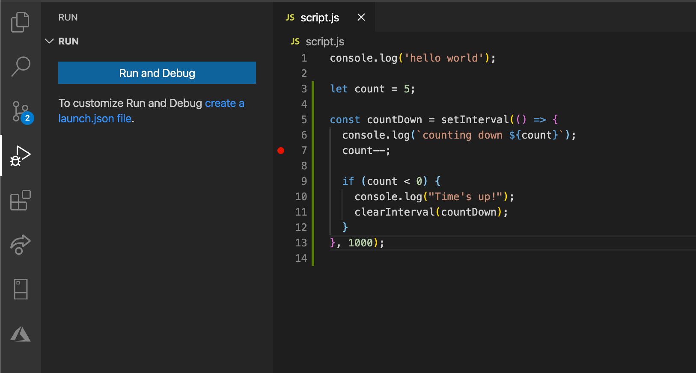

# Node.js Overview

## Learning Objectives

By the end of this lesson, you will be able to:

- Node.js is and how it's different from the browser
- blocking versus non-blocking patterns in Node.js
- the Node.js REPL environment
- Node.js debugging tools

## Table of Contents

- [Node.js Overview](#nodejs-overview)
  - [What is Node.js?](#what-is-nodejs)
  - [Node.js Uses the V8 JavaScript Engine](#nodejs-uses-the-V8-javascript-engine)
  - [Node.js versus the Browser](#nodejs-versus-the-browser)
  - [Node.js Motivation](#nodejs-motivation)
    - [Blocking Code](#blocking-code)
    - [Non-Blocking Code](#non-blocking-code)
    - [Non-Blocking Code Benefits](#non-blocking-code-benefits)
    - [Node.js Case Studies](#nodejs-case-studies)
- [Installing Node.js](#installing-nodejs)
  - [Node Version Manager](#node-version-manager-nvm)
- [Installing Visual Studio Code](#installing-visual-studio-code-optional)
- [**_CODE-ALONG_**: Exploring the Node.js REPL Environment](#code-along-exploring-the-nodejs-repl-environment)
- [**_CODE-ALONG_**: Setup Course Folder & Test File](#code-along-setup-course-folder--test-file)
- [Debugging Node.js Applications Effectively](#debugging-nodejs-applications-effectively)
- [**_TRY-IT-OUT_**: Debugging with an Integrated Development Environment (IDE)](#try-it-out-debugging-with-an-integrated-development-environment-ide)
- [**_TRY-IT-OUT_**: Debugging with Chrome DevTools](#try-it-out-debugging-with-chrome-devtools)
- [**_REVIEW_**](#review)
- [Additional Resources](#additional-resources)

## Node.js Overview

### What is Node.js?

According to the [official website](https://nodejs.org/en/),

```
Node.js® is a JavaScript runtime built on Chrome's V8 JavaScript engine.
```

- JavaScript runtime
- Enables JavaScript to run outside of browser
- Portable and runs on Mac, Windows, Linux and several other systems.
- Free and open-sourced
- Used to build server-side applications; can handle high traffic efficiently

### Node.js uses the **V8** JavaScript Engine

- A JavaScript Engine is a program that compiles JavaScript to machine code that the operating system can understand

- **V8** is the name of the JS Engine that powers Node.js

  - created by Google
  - powers the Google Chrome
  - open-sourced since 2008
  - written in C++

- Node.js benefits from Google's investment in **_V8_**'s [improved performance year after year](https://V8.dev/blog/10-years)

- Other JavaScript Engines:
  - [SpiderMonkey](https://developer.mozilla.org/en-US/docs/Mozilla/Projects/SpiderMonkey)(Firefox)
  - [Chakra](<https://en.wikipedia.org/wiki/Chakra_(JScript_engine)>)(Edge)

### Node.js versus the Browser

Before the advent of Node.js, JavaScript could only run in the browser, and its primary purpose was to create browser interactions (e.g., adding click events). Node.js allows us to write JavaScript in the server to perform common server tasks, such as accessing the file system and connecting to databases.

However, while Node.js and browsers like Chrome both execute Javascript and use the same **V8** JavaScript engine, there are a few key differences between them:

| Browser                                           | Node.js                                                               |
| ------------------------------------------------- | --------------------------------------------------------------------- |
| Access to `document` and `window` objects         | Access to `http`, `fs` objects                                        |
| `global` object references the `window`           | `global` object references Node.js-specific modules                   |
| Uses ECMAScript modules (i.e., `import`,`export`) | Uses the CommonJS module system (i.e., `require()`, `module.exports`) |

<details><summary>Notes</summary>

Nowadays, JavaScript has proven to be among one of the most popular programming languages. If you're a developer who extensively uses Javascript, then Node.js offers a huge advantage - which is the ability to program your entire application - frontend and backend - in a single language.

However, while Node.js and browsers like Chrome both execute Javascript and use the same **V8** JavaScript engine, there are a few key differences between them:

- While Node.js and browsers share several common built-in JavaScript features (e.g., `Array`), there are several predefined objects that exist in one environment but not in the other. For example, Node.js does not have access to the `document` and `window` objects, which are used on the client-side for Document Object Model (DOM) manipulation and user event handling. The browser, on the other hand, does not have access to Node.js API's such as `http` and `fs`, which are needed for setting up web servers and manipulating file systems, respectively.

- Both have access to a `global` object. In the browser, the `global` object references the `window` object. In Node.js, however, the `global` object exposes a collection of useful modules, functions, and strings that we can use in our programs.

- Node.js uses the CommonJS module system, which uses `require()` and `module.exports`, to share code between different files. In the browser, we are starting to see the ECMAScript modules standard, which uses the `import` and `export` statements, being implemented. As of October 2020, ECMAScript modules is still an experimental feature only in Node.js.

</details>

### Node.js Motivation

- First released in 2009 by a programmer named Ryan Dahl
- There were two major issues with popular servers at that time:
  - Apache HTTP server has issues with handling multiple concurrent requests
  - Blocking code

#### Blocking Code

To understand why Node.js is an excellent choice for creating scalable network applications, we must first understand **_blocking_** and **_non-blocking_** code as they relate to `I/O` operations.

`I/O` stands for input/output, which is needed whenever a Node.js app is communicating with the server it's running on (e.g., reading some data from a file on the file system) or some other server (e.g., querying the database, reading from the network).

Blocking methods execute **_synchronously_**. Suppose our application has the following code to read a file:

```js
const fs = require("fs"); // load the file system module
const data = fs.readFileSync("/file.md", "utf-8"); // while waiting for the file to be read, can't do anything else!
console.log(data);
doMoreStuff(); // will run after the console.log on the previous line
```

The example above is synchronous.

`fs.readFileSync()` will block the execution of any additional JavaScript (e.g., `doMoreStuff()`) until the entire `/file.md` file is read.

If an error is thrown, it will need to be caught or the process will crash.

<details><summary>Can we use threads here?</summary>

Possibly! But...

- Spawning a new thread for each request is expensive (i.e., memory and CPU)
- As number of threads increase, so does memory usage
- Multi-threaded applications result in increased complexity
  - e.g., multiple threads accessing shared data
- Non-blocking code is a better alternative to multi-threading!

</details>

#### Non-Blocking Code

Non-blocking methods execute **_asynchronously._**

And here is the **_asynchronous_** version of the file read operation from the previous section:

```js
const fs = require("fs"); // load the file system module
// pass callback function as a third argument
fs.readFile("/file.md", "utf-8", (err, data) => {
  if (err) throw err;
  console.log(data);
});
doMoreStuff(); // will run before console.log
```

In the asynchronous version,

- `fs.readFile()` is non-blocking so JavaScript execution can continue and `doMoreStuff()` will be called first
- You can pass a callback as a third argument to `fs.readFile`. During program execution, this callback function gets sent to a callback queue; it gets invoked when the file read is finished.
  - This ability to register a callback in an asynchronous call is what makes Node.js **event-driven**.
  - You can handle any errors in this callback; the first argument of this callback gives us access to the error object (i.e., error-first callback).

<details><summary>How does JavaScript know to run a callback function asynchronously?</summary>

Because of something running behind the scenes called the [Event Loop](https://nodejs.org/en/docs/guides/event-loop-timers-and-nexttick/)!

A detailed discussion of the Event Loop is outside the scope of this course, but here's an excellent [video](https://www.youtube.com/watch?v=8aGhZQkoFbQ) about the event loop.

This mechanism helps us invoke the callback function when the main function has finished function.

The Event Loop is neither part of the **_V8_** JavaScript Engine nor is it part of the JavaScript language. It is implemented by a library called [`libuv`](https://github.com/libuv/libuv) within Node.js.

</details>

#### Non-Blocking Code Benefits

Non-blocking paradigms allow Node.js to process other code or make other requests while waiting for a response from some long-running operations (e.g., network requests).

A Node.js app is capable of handling higher throughput and thousands of concurrent connections while processing multiple requests at the same time in a single thread, without having to create a new thread for every request.

For this reason, Node.js libraries are normally created using non-blocking paradigms.

Node.js is not a suitable choice for CPU-intensive and heavy computing workloads (e.g., video transcoding, graphics processing, sort a billion users), since CPU tasks are **_not_** executed asynchronously and will block the single Node.js thread, causing the application to be unresponsive.

#### Node.js Case Studies

- [The Evolution of Node.js at Netflix](https://openjsf.org/blog/2020/09/24/from-streaming-to-studio-the-evolution-of-node-js-at-netflix/)
- [How Node.js Saved the US Government \$100k](https://openjsf.org/blog/2020/09/11/how-node-js-saved-the-u-s-government-100k/)
- [How the Weather Company uses Node.js in Production](https://openjsf.org/blog/2020/05/27/how-the-weather-company-uses-node-js-in-production/)
- [Node.js PayPal](https://medium.com/paypal-engineering/node-js-at-paypal-4e2d1d08ce4f)
- [Building with Node.js at LinkedIn](https://medium.com/building-with-x/building-with-node-js-at-linkedin-ae4ea6af12f2)
- [Designing Edge Gateway, Uber's Lifecycle Management Platform](https://eng.uber.com/gatewayuberapi/)
- [Other Case Studies](https://thinkmobiles.com/blog/node-js-app-examples/)

## Installing Node.js

Node.js is free, open-source, and available for all operating systems. You can install Node.js by either downloading the source code or installing it with Homebrew.

- **Downloading the Source Code:** Official packages for all the major platforms are available at https://nodejs.org/en/download/. Other package managers for Linux and Windows are listed in https://nodejs.org/en/download/package-manager/

- **Installing with Homebrew:** [Homebrew](https://brew.sh/) is a popular package manager for macOS and Linux operating systems. On macOS, if you already have Homebrew installed, you can install Node.js very easily by running the following command in your terminal:

```

brew install node

```

For this course, make sure you're on version 10 or greater. You can check your Node.js version by running the following command in your terminal:

```

node --version

```

### Node Version Manager (nvm)

`nvm` is a popular way to run Node.js. This tool allows you to easily switch between Node.js versions, and install new versions to try out and easily rollback if needed.

- [How to install nvm](https://github.com/nvm-sh/nvm#installing-and-updating)
- [How to use nvm](https://github.com/nvm-sh/nvm#usage)

## Installing Visual Studio Code (Optional)

[VSCode](https://code.visualstudio.com/) offers a fantastic ecosystem of extensions and themes as well as debugging tools for Node.js. Like Node.js, it is free, open-source, and available for all operating systems. It is the recommended code editor for this course.

## **_CODE-ALONG_**: Exploring the Node.js REPL Environment

When Node.js is installed, you'll have access to the node executable program in the terminal.

1. Open up your terminal.

1. Type `node` into your terminal. This will open up a REPL or Read-Evaluate-Print-Loop where we can run individual node statements using JavaScript. The command stays in idle mode, waiting for us to input code.

1. Core JavaScript features we're familiar with in the browser like `toUpperCase()` are still available in Node.js. Try running the following with REPL:

   ```js
   "hello world".toUpperCase(); // returns 'HELLO WORLD'
   ```

1. Try entering the name of a JavaScript class, like `Number`, add a dot and press tab. The REPL will print all the properties and methods you can access on that class. Try running some of these methods and properties (e.g., `Number.MAX_VALUE`).

1. Inspect the global objects you have access to by typing `global.` and pressing tab. What do you see? Which of these global objects are you familiar with from browser-based JavaScript?

1. To exit REPL mode, simply type `.exit` or hit `CTRL + c` twice.

## **_CODE-ALONG_**: Setup Course Folder & Test File

Let's create a folder where you will save your work for this course! We'll call this folder `intro-to-nodejs-course`. I'm going to save my work in my home directory.

1. Navigate to your home directory:

   ```
   $ cd ~
   ```

1. Create a new folder called `intro-to-nodejs-course` and change into it:

   ```
   $ mkdir intro-to-nodejs-course
   $ cd intro-to-nodejs-course
   ```

1. Create a script file in your course directory:

   ```
   $ touch script.js
   ```

1. Add a `console.log` message to the `script.js` file:

   ```js
   // script.js
   console.log("hello world");
   ```

1. Run the script from terminal:

   ```
   $ node script.js
   ```

What do you see?

If the filename is omitted, we use Node.js in REPL mode.

## Debugging Node.js Applications Effectively

Many developers use `console.log` to debug their Node.js applications. This technique is great for dumping a variable to the terminal so you can check its value or figuring out what order your code is running in. However, it is not really the best option.

Using `console.log` to debug your code generally slows down the development process, as you'd have to repeatedly stop your app, insert a `console.log`, and start your app again. Also, it complicates the debugging process as you're trying to log out the values you're debugging amidst the noise of other logging operations.

### **_TRY-IT-OUT_**: Debugging with an Integrated Development Environment (IDE)

VSCode makes it really easy to start a debugging environment for our Node.js application! Let's take a look at an example.

1. In your `script.js`, add the following code:

   ```js
   // script.js

   let count = 5;
   // the setInterval() function invokes the callback every 1000 milliseconds
   const countDown = setInterval(() => {
     console.log(`counting down ${count}`);
     count--;

     if (count < 0) {
       console.log("Time's up!");
       clearInterval(countDown); // clears the timer when the count is negative
     }
   }, 1000);
   ```

1. If you're using VSCode, hit `Command + Shift + D` to launch the debugger. Select Node.js as the environment. Let's set a breakpoint by clicking to the left of the `count--` line.

   

1. Next, press the `Run and debug` button on the left side of the window. The application automatically stops at the breakpoint we just set. You can start stepping through the code to observe how the `count` variable changes during code execution!

Later on in the course, we will learn a few more advanced debugging techniques.

### **_TRY-IT-OUT_**: Debugging with Chrome DevTools

Developers often use the Chrome DevTools to debug client-side JavaScript code. Since Chrome and Node.js share the same **V8** JavaScript engine, it is also possible to use the Chrome DevTools for debugging and profiling your applications.

Chrome DevTools gives us access to the profiler, stack visualization information, code navigation features, and a very cool debugger. A [debugger](https://nodejs.org/api/debugger.html) is automatically bundled with your Node.js installation.

1. Attach Chrome DevTools to a Node.js instance for debugging! Open your terminal and run

   ```
   $ node --inspect-brk script.js
   ```

1. Then in Chrome type this URL: `chrome://inspect`.

1. Click the `inspect` link next to the Node target, and you’ll have access to Node.js in the browser DevTools. You can now insert breakpoints and step through the code!

## **_REVIEW_**

- What is Node.js?
- What is **_V8_**?
- What is blocking code? What is non-blocking code? Which paradigm contributes to Node.js' performance and why?
- What are the differences and similarities between Node.js and the browser?

#### Additional Resources:

- [Node.js Wikipedia page](https://en.wikipedia.org/wiki/Node.js)
- [A Brief History of Node.js](https://nodejs.dev/learn/a-brief-history-of-nodejs)
- [Node.js ECMAScript Modules](https://nodejs.org/api/esm.html#esm_ecmascript_modules)
- [Node.js Debugging in VSCode](https://code.visualstudio.com/docs/nodejs/nodejs-debugging)
- [Getting Started with Node.js Debugging in VSCode (Video)](https://www.youtube.com/watch?v=2oFKNL7vYV8)
- [Node.js Concurrency](https://tsh.io/blog/simple-guide-concurrency-node-js/)
- [Node.js Multi-Threading](https://blog.logrocket.com/node-js-multithreading-what-are-worker-threads-and-why-do-they-matter-48ab102f8b10/)
- [Video: Debugging Node.js with Chrome & Visual Studio Code](https://www.youtube.com/watch?v=hfpkMyvSOp4)
